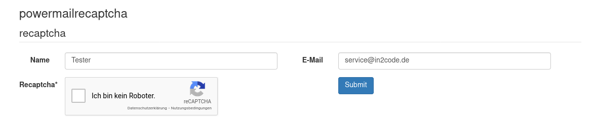

# powermailrecaptcha

## Google recaptcha for TYPO3 powermail to prevent spam




## Dependencies

* powermail >= 8.0
* TYPO3 Version >= 10
* Google recaptcha V2 (https://developers.google.com/recaptcha/docs/v2)

## Installation

- Just install this extension via composer `composer require in2code/powermailrecaptcha`
- Register your domain to www.google.com/recaptcha/ (registration direct link: https://g.co/recaptcha/v3 - reCAPTCHA, Version 2)
- Add sitekey and secretkey to TypoScript Constants (see example below)
- Ensure that spamshield is enabled (see below)
- Add a field of Type Google Recaptcha to your powermail form
- Have fun

Example for TypoScript Constants:

```
plugin.tx_powermailrecaptcha.sitekey = 6LdsBBUTAAAAAKMhI67inzeAvzBh5JdRRxlCwbTz
plugin.tx_powermailrecaptcha.secretkey = 6LdsBBUTAAAAAKMhaaaainzeAvzBh5JdRRxlCwbyy
```

## Common pitfalls and best practice

spamshield must be enabled in powermail (TypoScript setup):

```
plugin.tx_powermail.settings.setup.spamshield._enable = 1
```

Keep up to date if powermail recognize spam (TypoScript setup):

```
# Get an email if spam was recognized
plugin.tx_powermail.settings.setup.spamshield.email = spamreceiver@yourdomain.de

# Write to a logfile when spam was recognized
plugin.tx_powermail.settings.setup.spamshield.logfileLocation = typo3temp/logs/powermailSpam.log
```


## Changelog

| Version | Date       | Description                                                                                         |
|---------|------------|-----------------------------------------------------------------------------------------------------|
| 5.1.0   | 2022-01-19 | Support for TYPO3 11Fix typo in ter-release.yml file                                                |
| 5.0.3   | 2021-09-25 | Fix typo in ter-release.yml file                                                                    |
| 5.0.2   | 2021-09-09 | Add extension key to composer.json                                                                  |
| 5.0.1   | 2020-12-03 | Add TYPO3 dependency to ext_emconf.php to make TER upload happy                                     |
| 5.0.0   | 2020-12-03 | Update dependencies for powermail 8.x                                                               |
| 4.0.0   | 2018-11-21 | Update dependencies for powermail 7.x                                                               |
| 3.0.0   | 2018-07-13 | Update dependencies for powermail 6.x                                                               |
| 2.0.0   | 2018-02-14 | Update dependencies for powermail 5.x                                                               |
| 1.1.0   | 2017-11-04 | Update dependencies for powermail 4.x                                                               |
| 1.0.1   | 2016-08-06 | Activate check only if form has a recaptcha field and not every time, some more stuff in the manual |
| 1.0.0   | 2016-08-06 | Initial upload - have fun                                                                           |
